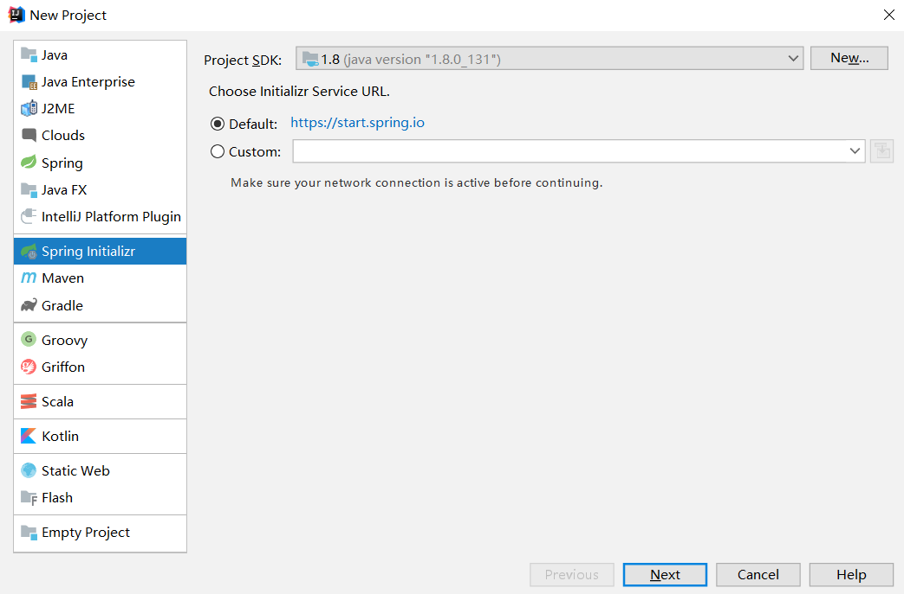
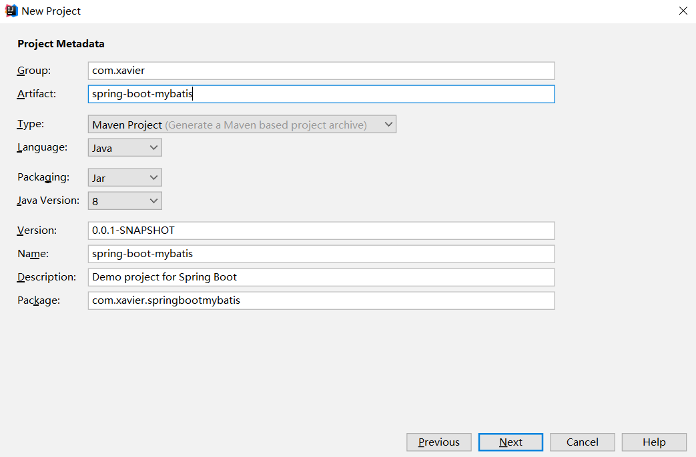
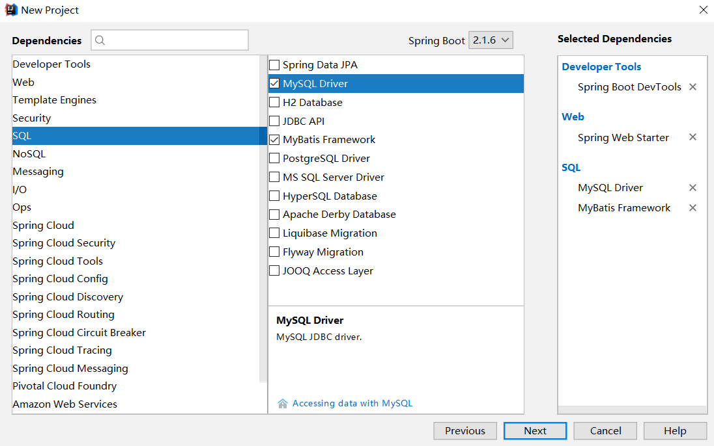
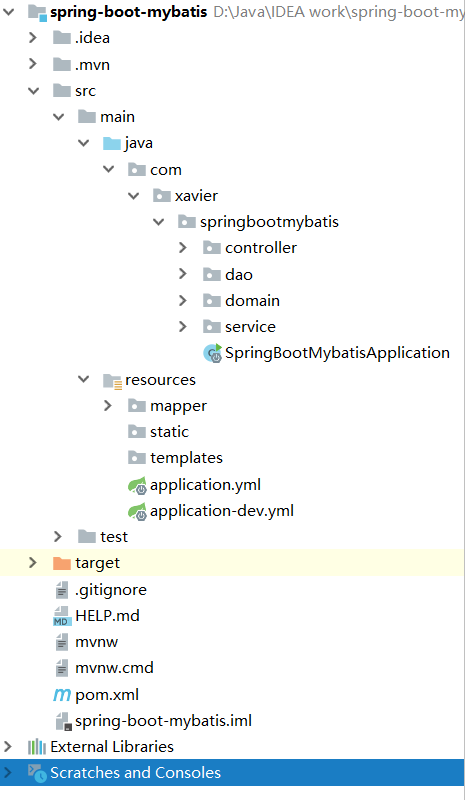
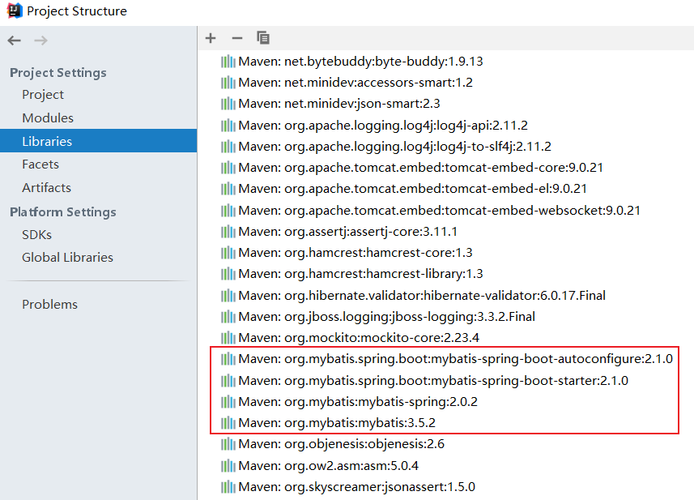
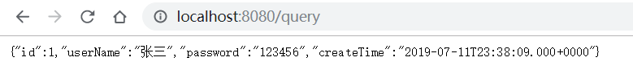

# SpringBoot与MyBatis整合

这里讲解Spring Boot和MyBatis的整合教程。

## 1. 前期准备

开发环境：

- 开发工具：IDEA
- JDK：1.8
- 框架：Spring Boot、Maven、Mybatis

创建项目：



下一步在 Project Metadata：



再选择 Dependencies：



在这里我选了四个依赖：

- Spring Boot DevTools：实现项目热部署
- Spring Web Starter：Web项目需要
- MySQL Driver：提供MySQL驱动
- MyBatis：提供MyBatis依赖

最后建成的项目目录结构如下：



Maven依赖：

```xml
<?xml version="1.0" encoding="UTF-8"?>
<project xmlns="http://maven.apache.org/POM/4.0.0" xmlns:xsi="http://www.w3.org/2001/XMLSchema-instance"
         xsi:schemaLocation="http://maven.apache.org/POM/4.0.0 http://maven.apache.org/xsd/maven-4.0.0.xsd">
    <modelVersion>4.0.0</modelVersion>
    <parent>
        <groupId>org.springframework.boot</groupId>
        <artifactId>spring-boot-starter-parent</artifactId>
        <version>2.1.6.RELEASE</version>
        <relativePath/> <!-- lookup parent from repository -->
    </parent>
    <groupId>com.xavier</groupId>
    <artifactId>spring-boot-mybatis</artifactId>
    <version>0.0.1-SNAPSHOT</version>
    <name>spring-boot-mybatis</name>
    <description>Demo project for Spring Boot</description>

    <properties>
        <java.version>1.8</java.version>
    </properties>

    <dependencies>
        <!--Spring Boot-->
        <dependency>
            <groupId>org.springframework.boot</groupId>
            <artifactId>spring-boot-starter-web</artifactId>
        </dependency>
        <dependency>
            <groupId>org.mybatis.spring.boot</groupId>
            <artifactId>mybatis-spring-boot-starter</artifactId>
            <version>2.1.0</version>
        </dependency>
        <dependency>
            <groupId>org.springframework.boot</groupId>
            <artifactId>spring-boot-devtools</artifactId>
            <scope>runtime</scope>
            <optional>true</optional>
        </dependency>
        <dependency>
            <groupId>org.springframework.boot</groupId>
            <artifactId>spring-boot-starter-test</artifactId>
            <scope>test</scope>
        </dependency>

        <dependency>
            <groupId>mysql</groupId>
            <artifactId>mysql-connector-java</artifactId>
            <version>6.0.6</version>
            <scope>runtime</scope>
        </dependency>
    </dependencies>

    <build>
        <plugins>
            <plugin>
                <groupId>org.springframework.boot</groupId>
                <artifactId>spring-boot-maven-plugin</artifactId>
            </plugin>
        </plugins>
    </build>
</project>
```

因为我们在创建项目时选中了MyBatis Framework，所以这里可以不用显示地添加MyBatis的依赖，实际上我们打开项目的结构的依赖库可以看到MyBatis的依赖：



## 2. Spring配置文件

本文不使用application.properties文件而使用更加简洁的application.yml文件（注意：yml配置文件中，有key和value，value一定要和冒号之间有空格，否则会报错）。将resource文件夹下原有的application.properties文件删除，创建application.yml配置文件（备注：其实SpringBoot底层会把application.yml文件解析为application.properties），本文创建了两个yml文件（application.yml和application-dev.yml），分别来看一下内容：

application.yml

```yml
# main configuration file

spring:
  profiles:
    active: dev
```

application-dev.yml

```yml
# 开发环境配置文件
# yml配置文件中，key和value，value一定要和冒号之间有空格

spring:
  # 配置数据源
  datasource:
    url: jdbc:mysql://127.0.0.1:3306/test1?useUnicode=true&characterEncoding=utf-8&useSSL=true&serverTimezone=UTC
    username: root
    password: 123456
    driver-class-name: com.mysql.cj.jdbc.Driver

mybatis:
  mapper-locations: classpath:mapper/*.xml
  # type-aliases-package: com.xavier.springbootmybatis.domain

# show sql
logging:
  level:
    com:
      xavier:
        springbootmybatis:
          dao: debug
```

这两个文件的作用是：

> 在项目中配置多套环境的配置方法。
> 因为现在一个项目有好多环境，开发环境，测试环境，准生产环境，生产环境，每个环境的参数不同，所以我们就可以把每个环境的参数配置到yml文件中，这样在想用哪个环境的时候只需要在主配置文件中将用的配置文件写上就行如application.yml
>
> 笔记：在Spring Boot中多环境配置文件名需要满足application-{profile}.yml的格式，其中{profile}对应你的环境标识，比如：
>
> application-dev.yml：开发环境
> application-test.yml：测试环境
> application-prod.yml：生产环境

Spring Boot会自动加载application.yml相关配置，数据源就会自动注入到sqlSessionFactory中，sqlSessionFactory会自动注入到Mapper中。

## 3. 实体类

User.java

```java
package com.xavier.springbootmybatis.domain;

import java.util.Date;

/**
 * @author Xavier Li
 * 2019/7/15
 */
public class User {

    private Long id;
    private String userName;
    private String password;
    private Date createTime;

    // getter, setter, toString
}
```

## 4. 映射类

UserDao.java，映射类取名UserDao或者UserMapper都行。记得要在映射类上加上`@Mapper`注解。

```java
package com.xavier.springbootmybatis.dao;

import com.xavier.springbootmybatis.domain.User;
import org.apache.ibatis.annotations.Mapper;
import org.springframework.stereotype.Component;

/**
 * @author Xavier Li
 * 2019/7/15
 */
@Mapper
@Component
public interface UserDao {

    /**
     * Find a user by id
     *
     * @param id user id
     * @return   user domain
     */
    User findUserById(Long id);

    /**
     * Insert a user
     *
     * @param user user domain
     * @return     result
     */
    int insertUser(User user);
}

```

## 5. 映射文件

在 resources 文件下创建一个mapper文件，在该文件下写MyBatis的SQL文件。

User.xml

```xml
<?xml version="1.0" encoding="UTF-8"?>
<!DOCTYPE mapper PUBLIC "-//mybatis.org//DTD Mapper 3.0//EN" "http://mybatis.org/dtd/mybatis-3-mapper.dtd">

<mapper namespace="com.xavier.springbootmybatis.dao.UserDao">
    <resultMap id="UserResultMap" type="com.xavier.springbootmybatis.domain.User">
        <id column="id" property="id" />
        <result column="username" property="userName" />
        <result column="password" property="password" />
        <result column="create_time" property="createTime" />
    </resultMap>

    <select id="findUserById" parameterType="long" resultMap="UserResultMap">
        SELECT * FROM user WHERE id=#{id}
    </select>

    <insert id="insertUser" parameterType="com.xavier.springbootmybatis.domain.User">
        INSERT INTO user (id, username, password, create_time) VALUES (#{id}, #{userName}, #{password}, #{createTime})
    </insert>
</mapper>
```

## 6. Service类

Service类上需要加上`@Service`注解，事务管理只需要在方法上加个注解：`@Transactional`。

UserService.java

```java
package com.xavier.springbootmybatis.service;

import com.xavier.springbootmybatis.dao.UserDao;
import com.xavier.springbootmybatis.domain.User;
import org.springframework.beans.factory.annotation.Autowired;
import org.springframework.stereotype.Service;
import org.springframework.transaction.annotation.Transactional;

/**
 * @author Xavier Li
 * 2019/7/15
 */
@Service
public class UserService {

    private UserDao userDao;

    @Autowired
    public UserService(UserDao userDao) {
        this.userDao = userDao;
    }

    public User findUserById(Long id) {
        return userDao.findUserById(id);
    }

    @Transactional(rollbackFor = Exception.class)
    public int insertUser(User user) {
        return userDao.insertUser(user);
    }
}
```

## 7. Controller类

UserController.java

```java
package com.xavier.springbootmybatis.controller;

import com.xavier.springbootmybatis.domain.User;
import com.xavier.springbootmybatis.service.UserService;
import org.springframework.beans.factory.annotation.Autowired;
import org.springframework.web.bind.annotation.RequestMapping;
import org.springframework.web.bind.annotation.RestController;

import java.util.Date;

/**
 * @author Xavier Li
 * 2019/7/15
 */
@RestController
public class UserController {

    private UserService userService;

    @Autowired
    public UserController(UserService userService) {
        this.userService = userService;
    }

    @RequestMapping("/hello")
    public String hello() {
        return "Hello World";
    }

    @RequestMapping("/query")
    public User query() {
        return userService.findUserById(1L);
    }

    @RequestMapping("/insert")
    public int insert() {
        User user = new User();
        user.setId(2L);
        user.setUserName("Nike");
        user.setPassword("000000");
        user.setCreateTime(new Date(System.currentTimeMillis()));
        return userService.insertUser(user);
    }
}
```

## 8. 测试

先测试：http://localhost:8080/demo/hello


再测试：http://localhost:8080/demo/query



我们查看控制台日志输出：

```
2019-07-15 23:22:48.811  INFO 848 --- [nio-8080-exec-1] com.zaxxer.hikari.HikariDataSource       : HikariPool-1 - Starting...
2019-07-15 23:22:48.914  INFO 848 --- [nio-8080-exec-1] com.zaxxer.hikari.HikariDataSource       : HikariPool-1 - Start completed.
2019-07-15 23:22:48.934 DEBUG 848 --- [nio-8080-exec-1] c.x.s.dao.UserDao.insertUser             : ==>  Preparing: INSERT INTO user (id, username, password, create_time) VALUES (?, ?, ?, ?) 
2019-07-15 23:22:48.947 DEBUG 848 --- [nio-8080-exec-1] c.x.s.dao.UserDao.insertUser             : ==> Parameters: 2(Long), Nike(String), 000000(String), 2019-07-15 23:22:48.807(Timestamp)
2019-07-15 23:22:48.949 DEBUG 848 --- [nio-8080-exec-1] c.x.s.dao.UserDao.insertUser             : <==    Updates: 1
2019-07-15 23:26:01.197 DEBUG 848 --- [nio-8080-exec-8] c.x.s.dao.UserDao.findUserById           : ==>  Preparing: SELECT * FROM user WHERE id=? 
2019-07-15 23:26:01.198 DEBUG 848 --- [nio-8080-exec-8] c.x.s.dao.UserDao.findUserById           : ==> Parameters: 1(Long)
2019-07-15 23:26:01.210 DEBUG 848 --- [nio-8080-exec-8] c.x.s.dao.UserDao.findUserById           : <==      Total: 1
```

可以看到执行的SQL，以及Spring Boot默认使用的数据库连接池：HikariPool。

再测试：http://localhost:8080/demo/insert


插入成功，给我们返回了一个数字1。

