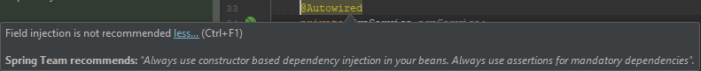
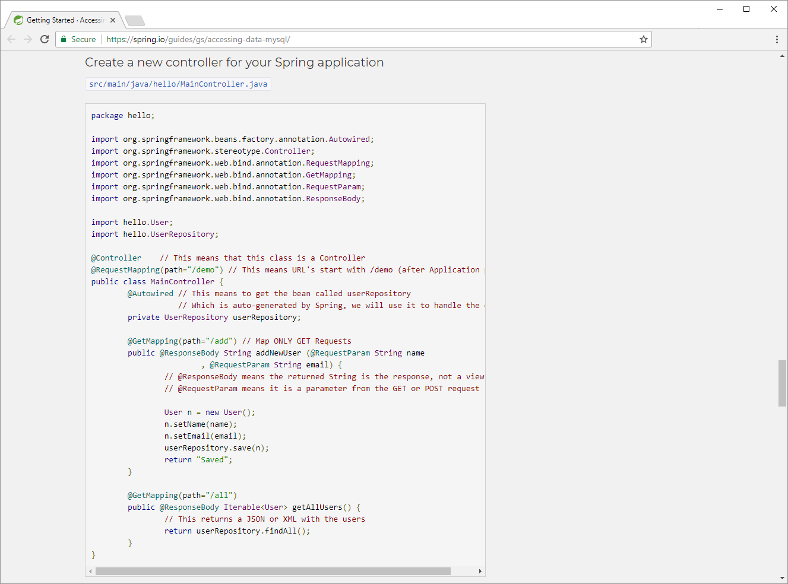

# Field injection is not recommended

文章来源：[Field injection is not recommended – Spring IOC](http://blog.marcnuri.com/field-injection-is-not-recommended/)

## Introduction

When running a static code analysis tool or inspecting/analyzing your code from your IDE, you may have encountered the following warning regarding your `@Autowired` fields:

> Field injection is not recommended



This post shows the different types of injections available in Spring and what are the recommended patterns to use each of them.

## Injection types

注入类型

Although [current documentation](https://docs.spring.io/spring/docs/5.0.3.RELEASE/spring-framework-reference/core.html#beans-factory-collaborators) for spring framework *(5.0.3)* only defines two major types of injection, in reality there are three;

- Constructor-based dependency injection
- Setter-based dependency injection
- Field-based dependency injection

The latter is the one which the static code analysis tool complains about, but is regularly and extensively used.

You can even see this injection method on some of Spring guides although being discouraged in the documentation:



### Constructor-based dependency injection

基于构造方法的依赖注入

In constructor-based dependency injection, the class constructor is annotated with `@Autowired` and includes a variable number of arguments with the objects to be injected.

```java
@Component
public class ConstructorBasedInjection {

    private final InjectedBean injectedBean;

    @Autowired
    public ConstructorBasedInjection(InjectedBean injectedBean) {
        this.injectedBean = injectedBean;
    }

}
```

The main advantage of constructor-based injection is that you can declare your injected fields final, as they will be initiated during class instantiation. This is convenient for required dependencies.

### Setter-based dependency injection

基于 Setter 方法的依赖注入

In setter-based dependency injection, setter methods are annotated with `@Autowired`. Spring container will call these setter methods once the Bean is instantiated using a no-argument constructor or a no-argument static factory method in order to inject the Bean’s dependencies.

```java
@Component
public class ConstructorBasedInjection {

    private InjectedBean injectedBean;

    @Autowired
    public void setInjectedBean(InjectedBean injectedBean) {
        this.injectedBean = injectedBean;
    }

}
```

### Field-based dependency injection

In field-based dependency injection, fields/properties are annotated with `@Autowired`. Spring container will set these fields once the class is instantiated.

```java
@Component
public class ConstructorBasedInjection {

    @Autowired
    private InjectedBean injectedBean;

}
```

As you can see, this is the cleanest way to inject dependencies as it avoids adding boilerplate code and there is no need to declare a constructor for the class. The code looks nice, neat and concise but as the code inspector already hinted us, there are some drawbacks to this approach.

## Field-based dependency injection drawbacks

### Disallows immutable field declaration

不允许声明不可变（final）字段

Field-based dependency injection won’t work on fields that are declared final/immutable as this fields must be instantiated at class instantiation. The only way to declare immutable dependencies is by using constructor-based dependency injection.

> 基于字段的依赖注入无法在声明为 final/immutable 的字段上工作，因为该字段必须在类实例化时被实例化。声明不可变依赖项的唯一方法是使用基于构造函数的依赖项注入。

### Eases single responsibility principle violation

违反单一职责原则

As you know, in object-oriented computer programming, the [SOLID](https://en.wikipedia.org/wiki/SOLID_(object-oriented_design)) acronym defines five design principles that will make your code understandable, flexible and maintainable.

> 如您所知，在面向对象的计算机编程中，SOLID首字母缩略词定义了五个设计原则，使您的代码易于理解，灵活且易于维护。

The [*S*](https://en.wikipedia.org/wiki/Single_responsibility_principle) in SOLID stands for single responsibility principle, meaning that a class should only be responsible for a single part of the functionality of the software application and all its services should be aligned narrowly with that responsibility.

> SOLID中的S代表单一责任原则，这意味着一个类应该只负责软件应用程序的单个功能部分，并且其所有服务应该与该职责紧密对齐。

With field-based dependency injection, it’s really easy to have lots of dependencies in your class and everything will look just fine. If constructor-based dependency injection is used instead, as more dependencies are added to your class, the constructor grows bigger and bigger and code starts to [smell](https://en.wikipedia.org/wiki/Code_smell), sending clear signals that something is wrong.

> 使用基于字段的依赖项注入，在类中拥有大量依赖项真的很容易，而且一切看起来都很好。如果使用基于构造函数的依赖项注入，随着更多的依赖项添加到类中，构造函数会变得越来越大，代码开始变得不那么好，发出明显的信号表明有问题。

Having a constructor with more than ten arguments is a clear sign that the class has too many collaborators and that maybe is a good time to start splitting the class into smaller and more maintainable pieces.

> 拥有一个参数超过十个的构造函数是一个明显的迹象，表明类有太多的合作者，这可能是一个开始将类拆分为更小、更可维护的部分的好时机。

So although field-injection is not directly responsible for breaking the single responsibility principle it surely enough helps by hiding signals that otherwise would be really clear.

> 因此，尽管基于字段的注入不是破坏单一责任原则的直接原因，但它确实通过隐藏坏信号起到了帮助的作用，如果不是这样的话，代码将不会很好的运行。

### Tightly coupled with dependency injection container

The main reason to use field-based injection is to avoid the boilerplate code for getters and setters or creating constructors for your class. In the end, this means that the only way these fields can be set are by Spring container instantiating the class and injecting them using reflection, otherwise the fields will remain null and your class will be broken/useless.

The dependency injection design pattern separates the creation of class dependencies from the class itself transferring this responsibility to a class injector allowing the program design to be loosely coupled and to follow the Single responsibility and Dependency inversion principles (again SOLID). So in the end the decoupling achieved for the class by autowiring its fields is lost by getting coupled again with the class injector (in this case Spring) making the class useless outside of a Spring container.

This means that if you want to use your class outside the application container, for example for unit testing, you are forced to use a Spring container to instantiate your class as there is no other possible way (but reflection) to set the autowired fields.

### Hidden dependencies

When using a dependency injection pattern, affected classes should clearly expose these dependencies using a public interface either by exposing the the required dependencies in the constructor or the optional ones using methods (setters). When using field-based dependency injection, the class is inherently hiding this dependencies to the outside world.

## Conclusion

We’ve seen that field-based injection should be avoided whenever possible due to its many drawbacks however elegant it may seem. The recommended approach is then to use constructor-based and setter-based dependency injection. Constructor-based injection is recommended for required dependencies allowing them to be immutable and preventing them to be null. Setter-based injection is recommended for optional dependencies.

> 我们已经看到，应尽可能避免现场注入，因为它有许多缺点，无论它看起来多么优雅。建议的方法是使用基于构造函数和基于setter的依赖注入。对于强制依赖的依赖项，建议使用基于构造函数的注入，以使它们不可变并防止为空。对于可选的依赖项，建议使用基于setter的注入。

## PS

变量方式注入非常简洁，没有任何多余代码，非常有效的提高了Java的简洁性。即使再多几个依赖一样能解决掉这个问题。

变量方式注入缺点：不能有效的指明依赖。相信很多人都遇见过一个bug，依赖注入的对象为null，在启动依赖容器时遇到这个问题都是配置的依赖注入少了一个注解什么的，然而这种方式就过于依赖注入容器了，当没有启动整个依赖容器时，这个类就不能运转，在反射时无法提供这个类需要的依赖。 
在使用 Setter 方式时，这是一种选择注入，可有可无，即使没有注入这个依赖，那么也不会影响整个类的运行。 
在使用构造器方式时已经显式注明必须强制注入，通过强制指明依赖注入来保证这个类的运行。

另一个方面： 
依赖注入的核心思想之一就是被容器管理的类不应该依赖被容器管理的依赖，换成白话来说就是如果这个类是使用了依赖注入的类，那么这个类摆脱了这几个依赖必须也能正常运行。然而使用变量注入的方式是不能保证这点的。 
既然使用了依赖注入方式，那么就表明这个类不再对这些依赖负责，这些都由容器管理，那么如何清楚的知道这个类需要哪些依赖呢？它就要使用  Setter 方法方式注入或者构造器注入。

强制依赖和可选依赖：在类被加载运行的时候就必须给他的依赖就是强制依赖，构造方法型依赖注入就是强制，初始化这个类就要给我这个依赖；选择依赖就是它在初始化的时候IOC不会给你注入，直到你使用到这个依赖时它才会把这个依赖给这个类，比如当你调用这个依赖的方法时才会给你把这个依赖给你注入进去，变量注入和 Setter 方法注入都是选择依赖

